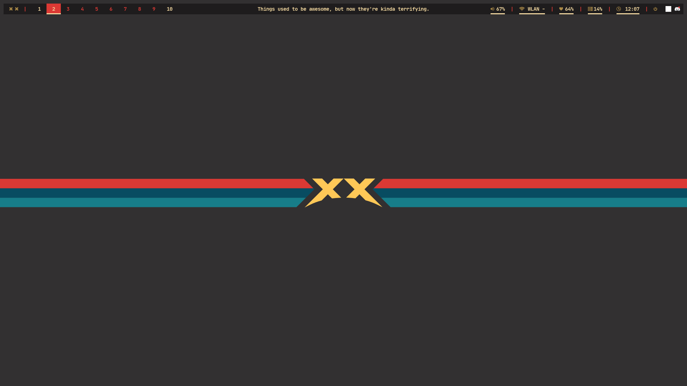
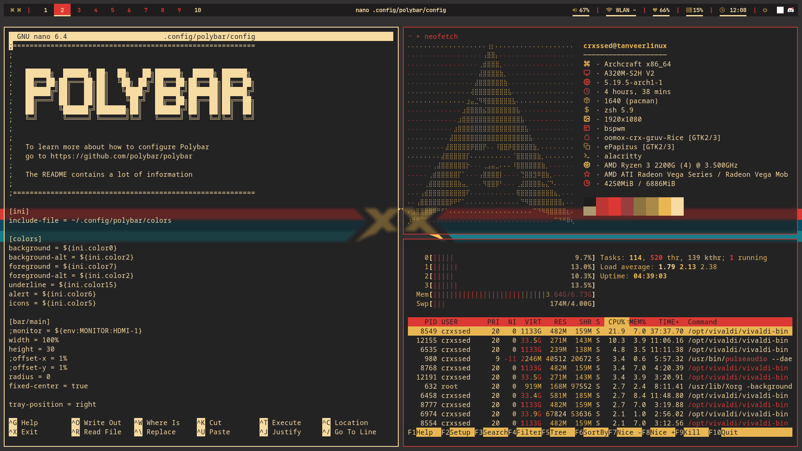

# .crx-gruv

## Arch Linux
- Archcraft OS (Not needed for this rice)

## Setup:
- Colors: pywal (`wal -i crx-gruv.png` should apply colors)
- Bar: Polybar
- Terminal: Alacritty
- Shell: ZSH (Oh-My-Zsh)
- WM: bspwm
- Hotkeys: sxhkd
- Launcher: Rofi
- Font[0]: JetBrains Mono Nerd Font
- GTK Themer: Oomox

## Screenshots

## Commands shown in screenshots:
- neofetch
- htop
- nano
